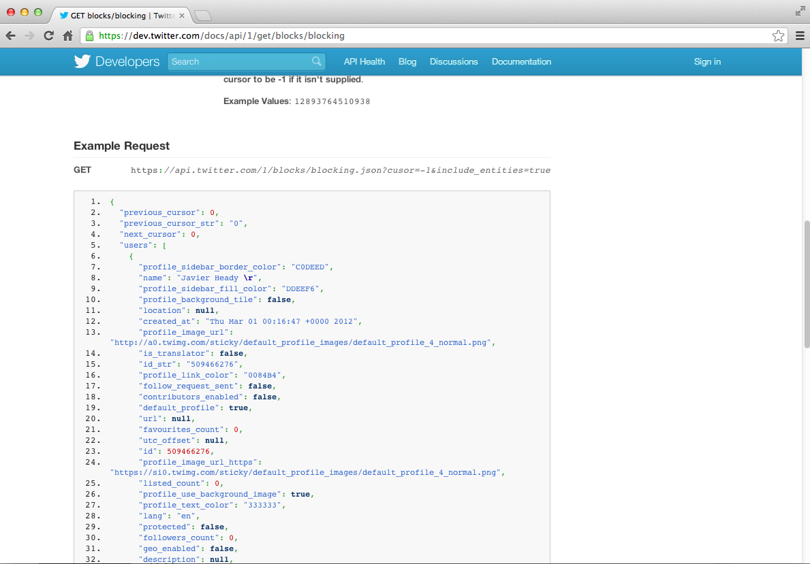

## Application programming interfaces



#### [https://dev.twitter.com/docs/api/1/get/blocks/blocking](https://dev.twitter.com/docs/api/1/get/blocks/blocking)

## Creating an application


#### [https://dev.twitter.com/apps](https://dev.twitter.com/apps)


``` r
## Accessing Twitter from R

myapp <- oauth_app("twitter",
                   key="yourConsumerKeyHere",
                   secret="yourConsumerSecretHere")
sig <- sign_oauth1.0(myapp,
                     token="yourTokenHere",
                     token_secret="yourTokenSecretHere")
homeTL <- GET("https://api.twitter.com/1.1/statuses/home_timeline.json", sig)
```

``` r
## Converting the json object

library(jsonlite)
json1 <- content(homeTL)
json2 <- jsonlite::fromJSON(toJSON(json1))
json2[1:10, 1:4]
```

``` r
                      created_at           id             id_str
1 Mon Jan 13 05:18:04 +0000 2014 4.225984e+17 422598398940684288
                                                                                                                                         text
1 Now that P. Norvig's regex golf IPython notebook hit Slashdot, let's see if our traffic spike tops the prev
```

## How did I know what url to use?


#### [https://dev.twitter.com/docs/api/1.1/get/search/tweets](https://dev.twitter.com/docs/api/1.1/get/search/tweets)

## In general look at the documentation


#### [https://dev.twitter.com/docs/api/1.1/overview](https://dev.twitter.com/docs/api/1.1/overview)

- httr allows GET, POST, PUT, DELETE requests if you are authorized
- You can authenticate with a username and/or password
- Most modern APIs use something like oauth
- httr works well with Facebook, Google, Twitter, Github, etc.

