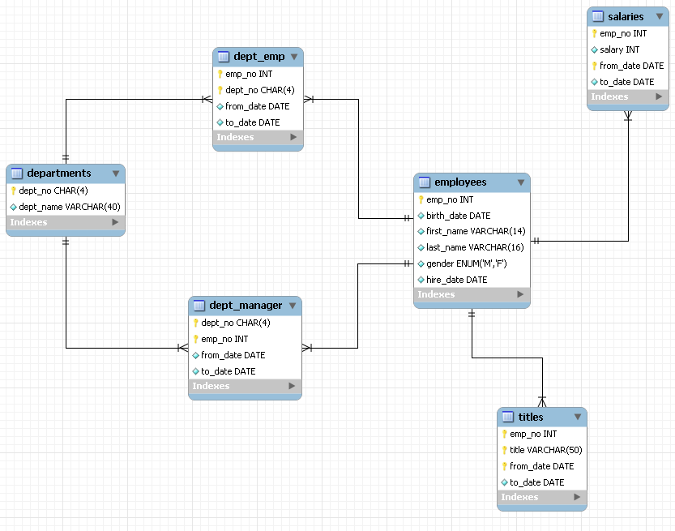
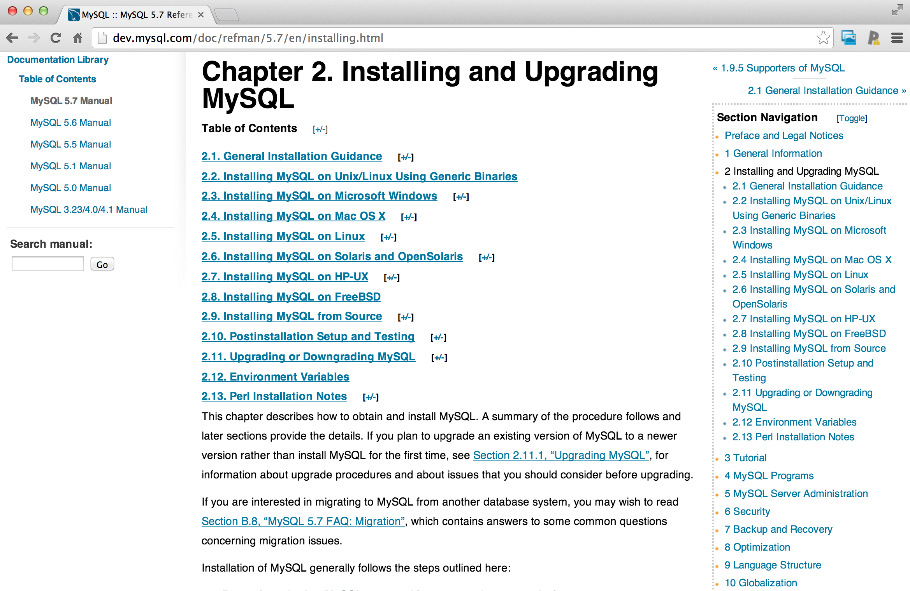
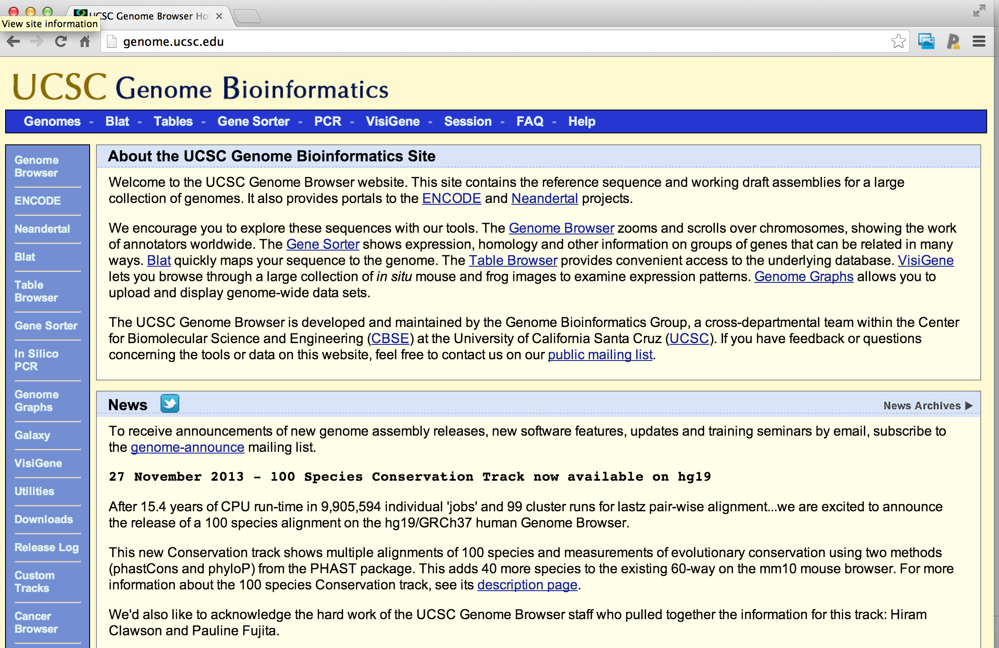
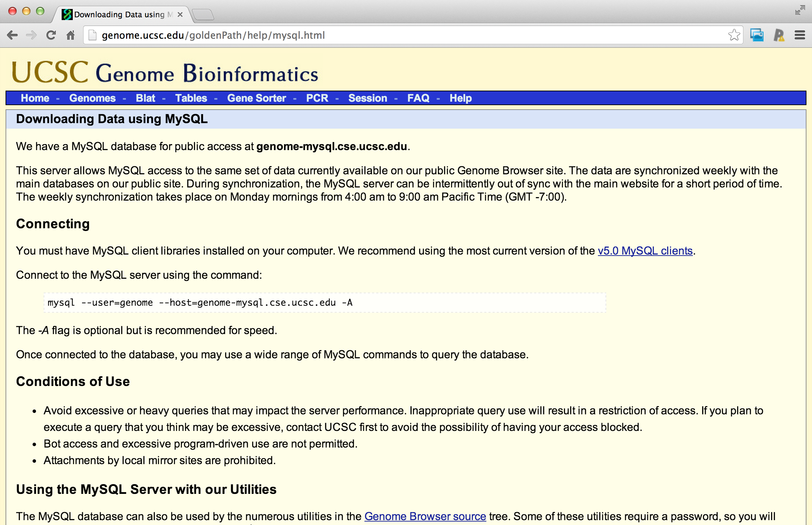

# Reading from MySQL
---
## mySQL
- Free and widely used open source database software
- Widely used in internet based applications
- Data are structured in
	- Databases
	- Tables within databases
	- Fields within tables
- Each row is called a record

##### [http://en.wikipedia.org/wiki/MySQL](http://en.wikipedia.org/wiki/MySQL) [http://www.mysql.com/](http://www.mysql.com/)

## Example structure



##### [http://dev.mysql.com/doc/employee/en/sakila-structure.html](http://dev.mysql.com/doc/employee/en/sakila-structure.html)

## Step 1 - Install MySQL



##### [http://dev.mysql.com/doc/refman/5.7/en/installing.html](http://dev.mysql.com/doc/refman/5.7/en/installing.html)

## Step 2 - Install RMySQL
- On a Mac: `install.packages("RMySQL")`
- On Windows:
	- Official instructions - [http://biostat.mc.vanderbilt.edu/wiki/Main/RMySQL](http://biostat.mc.vanderbilt.edu/wiki/Main/RMySQL) (may be useful for Mac/UNIX users as well)
	- Potentially useful guide - [http://www.ahschulz.de/2013/07/23/installing-rmysql-under-windows/](http://www.ahschulz.de/2013/07/23/installing-rmysql-under-windows/)

## Example - UCSC database


##### [http://genome.ucsc.edu/](http://genome.ucsc.edu/)


##### [http://genome.ucsc.edu/goldenPath/help/mysql.html](http://genome.ucsc.edu/goldenPath/help/mysql.html)

## Connecting and listing databases

``` r
# Test connection to UCSC Genome Database
require(RMySQL)
ucscDb <- dbConnect(MySQL(), user="genome", host="genome-mysql.cse.ucsc.edu")
result <- dbGetQuery(ucscDb, "show databases;")
dbDisconnect(ucscDb)
result
```

## Connecting to hg19 and listing tables

``` r
# Connecting to hg19 and listing tables
require(RMySQL)
hg19 <- dbConnect(MySQL(), user="genome", db="hg19",
                  host="genome-mysql.cse.ucsc.edu")
allTables <- dbListTables(hg19)
length(allTables)
allTables[1:5]
```

## Get dimensions of a specific table

``` r
# Get dimensions of a specific table
dbListFields(hg19, "affyU133Plus2")
dbGetQuery(hg19, "select count(*) from affyU133Plus2")
```
## Read from the table

``` r
# Read from the table
affyData <- dbReadTable(hg19, "affyU133Plus2")
head(affyData)
```

## Select a specific subset

``` r
# Select a specific subset
query <- dbSendQuery(hg19, 
                     "SELECT * FROM affyU133Plus2 WHERE misMatches BETWEEN 1 AND 3")
affyMis <- fetch(query)
quantile(affyMis$misMatches)
affyMisSmall <- fetch(query, n=10)
dbClearResult(query)
dim(affyMisSmall)
```

## Don't forget to close the connection!

``` r
# Don't forget to close the connection!
dbDisconnect(hg19)
```

## Further resources
- RMySQL vignette [http://cran.r-project.org/web/packages/RMySQL/RMySQL.pdf](http://cran.r-project.org/web/packages/RMySQL/RMySQL.pdf)
- List of commands [http://www.pantz.org/software/mysql/mysqlcommands.html](http://www.pantz.org/software/mysql/mysqlcommands.html)
	- **Do not, do not delete, add, or join things from ensembl. Only select.**
	- In general be careful with MySQL commands.
- A nice blog post summarizing some other commands [http://www.r-bloggers.com/mysql-and-r/](http://www.r-bloggers.com/mysql-and-r/)