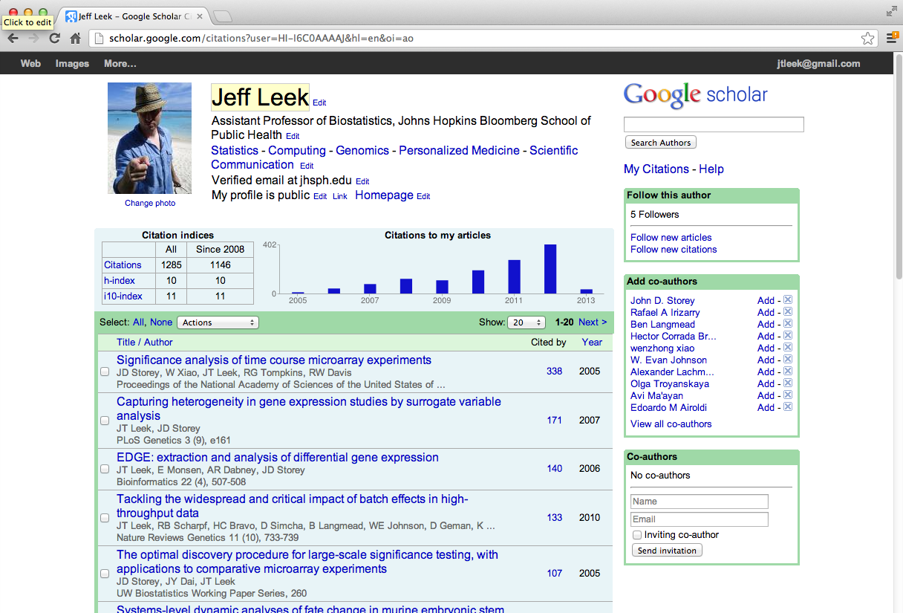

## Webscraping
#### **Webscraping:** Programmatically extracting data from the HTML code of websites.

- It can be a great way to get data [How Netflix reverse engineered Hollywood](http://www.theatlantic.com/technology/archive/2014/01/how-netflix-reverse-engineered-hollywood/282679/)
- Many websites have information you may want to programmatically read
- In some cases this is against the terms of service for the website
- Attempting to read too many pages too quickly can get your IP address blocked.

#### [http://en.wikipedia.org/wiki/Web_scraping](http://en.wikipedia.org/wiki/Web_scraping)

## Example: Google scholar

#### [http://scholar.google.com/citations?user=HI-I6C0AAAAJ&hl=en](http://scholar.google.com/citations?user=HI-I6C0AAAAJ&hl=en)

## Getting data off webpages - readLines()

``` r
con <- url("http://scholar.google.com/citations?user=HI-I6C0AAAAJ&hl=en")
htmlCode <- readLines(con)
close(con) # Very important!
htmlCode
```

``` r
[1] "<!DOCTYPE html><html><head><title>Jeff Leek - Google Scholar Citations</title><meta name=\"robots\" cont
```

## Parsing with XML

``` r
library(XML)
url <- "http://scholar.google.com/citations?user=HI-I6C0AAAAJ&hl=en"
html <- htmlTreeParse(url, useInternalNodes=T)

xpathSApply(html, "//title", xmlValue)
```

``` r
[1] "Jeff Leek - Google Scholar Citations"
```

``` r
xpathSApply(html, "//td[@id='col-citedby']", xmlValue)
```

``` r
 [1] "Cited by" "397"      "259"      "237"      "172"      "138"      "125"      "122"     
 [9] "109"      "101"      "34"       "26"       "26"       "24"       "19"       "13"      
[17] "12"       "10"       "10"       "7"        "6"       
```

## GET from the httr package

``` r
install.packages("httr")
library(httr)
html2 <- GET(url)
content2 <- content(html2, as="text")
parsedHtml <- htmlParse(content2, asText=T)
xpathSApply(parsedHtml, "//title", xmlValue)
```

``` r
[1] "Jeff Leek - Google Scholar Citations"
```

## Accessing websites with passwords

``` r
library(httr)
pg1 <- GET("http://httpbin.org/basic-auth/user/passwd")
pg1
```
``` r
Response [http://httpbin.org/basic-auth/user/passwd]
  Date: 2015-04-14 19:09
  Status: 401
  Content-Type: <unknown>
<EMPTY BODY>
```

#### [http://cran.r-project.org/web/packages/httr/httr.pdf](http://cran.r-project.org/web/packages/httr/httr.pdf)

``` r
pg2 <- GET("http://httpbin.org/basic-auth/user/passwd",
           authenticate("user", "passwd"))
pg2
```

``` r
Response [http://httpbin.org/basic-auth/user/passwd]
  Status: 200
  Content-type: application/json
{
  "authenticated": true,
  "user": "user"
} 
```

``` r
names(pg2)
```

``` r
[1] "url"         "handle"      "status_code" "headers"     "cookies"     "content"    
[7] "times"       "config"     
```

## Using handles

``` r
google <- handle("http://google.com") # Your authentication stays w/ the handle
pg1 <- GET(handle=google, path="/")
pg2 <- GET(handle=google, path="search")
```

#### [http://cran.r-project.org/web/packages/httr/httr.pdf](http://cran.r-project.org/web/packages/httr/httr.pdf)

## Notes and further resources
- R Bloggers has a number of examples of web scraping [http://www.r-bloggers.com/?s=Web+Scraping](http://www.r-bloggers.com/?s=Web+Scraping)
- The httr help file has useful examples [http://cran.r-project.org/web/packages/httr/httr.pdf](http://cran.r-project.org/web/packages/httr/httr.pdf)
- See later lectures on APIs