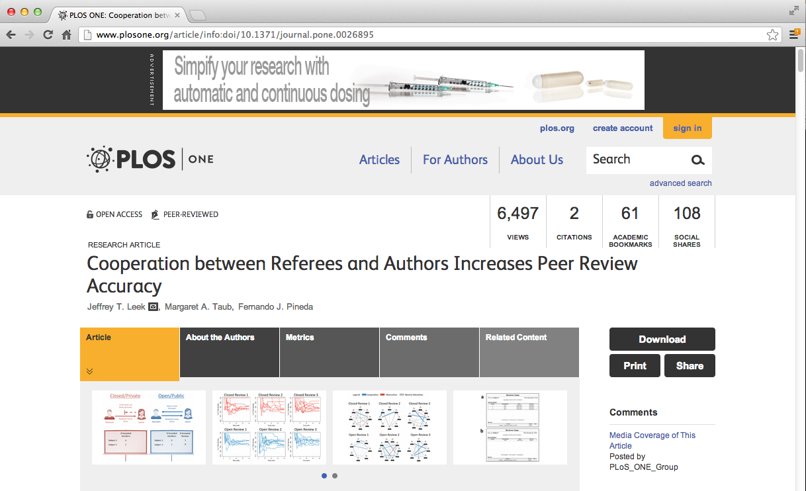

## Peer review experiment data



[http://www.plosone.org/article/info:doi/10.1371/journal.pone.0026895](http://www.plosone.org/article/info:doi/10.1371/journal.pone.0026895)

## Peer review data

``` r
if(!file.exists("./data")) { dir.create("./data") }
fileUrl1 = "https://dl.dropboxusercontent.com/u/7710864/data/reviews-apr29.csv"
fileUrl2 = "https://dl.dropboxusercontent.com/u/7710864/data/solutions-apr29.csv"
download.file(fileUrl1, destfile="./data/reviews.csv")
download.file(fileUrl2, destfile="./data/solutions.csv")
reviews <- read.csv("./data/reviews.csv")
solutions <- read.csv("./data/solutions.csv")
head(reviews, 2)
```
``` r
  id solution_id reviewer_id      start       stop time_left accept
1  1           3          27 1304095698 1304095758      1754      1
2  2           4          22 1304095188 1304095206      2306      1
```
``` r
head(solutions, 2)
```
``` r
  id problem_id subject_id      start       stop time_left answer
1  1        156         29 1304095119 1304095169      2343      B
2  2        269         25 1304095119 1304095183      2329      C
```

## Merging (really joining) data - `merge()`

- Merges data frames
- Important parameters: `x`, `y`, `by`, `by.x`, `by.y`, `all`

``` r
names(reviews)
```
``` r
[1] "id"          "solution_id" "reviewer_id" "start"       "stop"       
[6] "time_left"   "accept"
```
``` r
names(solutions)
```
``` r
[1] "id"         "problem_id" "subject_id" "start"      "stop"       "time_left" 
[7] "answer" 
```

``` r
mergedData <- merge(reviews, solutions, by.x="solution_id", by.y="id", all=T)
head(mergedData)
```
``` r
  solution_id id reviewer_id    start.x     stop.x time_left.x accept problem_id
1           1  4          26 1304095267 1304095423        2089      1        156
2           2  6          29 1304095471 1304095513        1999      1        269
3           3  1          27 1304095698 1304095758        1754      1         34
4           4  2          22 1304095188 1304095206        2306      1         19
5           5  3          28 1304095276 1304095320        2192      1        605
6           6 16          22 1304095303 1304095471        2041      1        384
  subject_id    start.y     stop.y time_left.y answer
1         29 1304095119 1304095169        2343      B
2         25 1304095119 1304095183        2329      C
3         22 1304095127 1304095146        2366      C
4         23 1304095127 1304095150        2362      D
5         26 1304095127 1304095167        2345      A
6         27 1304095131 1304095270        2242      C
```

## Default - merge all common column names

``` r
intersect(names(solutions), names(reviews)) # All common column names
```
``` r
[1] "id"        "start"     "stop"      "time_left"
```
``` r
mergedData2 <- merge(reviews, solutions, all=T)
head(mergedData2)
```
``` r
  id      start       stop time_left solution_id reviewer_id accept problem_id
1  1 1304095119 1304095169      2343          NA          NA     NA        156
2  1 1304095698 1304095758      1754           3          27      1         NA
3  2 1304095119 1304095183      2329          NA          NA     NA        269
4  2 1304095188 1304095206      2306           4          22      1         NA
5  3 1304095127 1304095146      2366          NA          NA     NA         34
6  3 1304095276 1304095320      2192           5          28      1         NA
  subject_id answer
1         29      B
2         NA   <NA>
3         25      C
4         NA   <NA>
5         22      C
6         NA   <NA>
```

## Using join in the `plyr` package

##### _Faster, but less full featured - defaults to left join, see help file for more_

``` r
library(plyr)
df1 <- data.frame(id=sample(1:10), x=rnorm(10))
df2 <- data.frame(id=sample(1:10), y=rnorm(10))
arrange(join(df1, df2), id)
```
``` r
   id         x           y
1   1 1.2821355 -0.91057542
2   2 0.8784095 -0.03373696
3   3 1.5512277  1.00233620
4   4 1.6846821 -0.32882634
5   5 0.2622324  0.54752891
6   6 1.1390731  0.17524751
7   7 0.4102025 -0.27786406
8   8 1.0131565 -0.70426483
9   9 2.8134231 -0.50288258
10 10 2.6280185 -1.46684466
```

## If you have multiple data frames

``` r
library(plyr)
df1 <- data.frame(id=sample(1:10), x=rnorm(10))
df2 <- data.frame(id=sample(1:10), y=rnorm(10))
df3 <- data.frame(id=sample(1:10), z=rnorm(10))
dfList <- list(df1, df2, df3)
join_all(dfList)
```
``` r
   id          x          y          z
1   8 -1.0194694  0.2857754  0.5920846
2   7 -0.1297366 -0.3515936 -0.3050561
3   3  0.8656001 -0.4873699  0.4995546
4  10 -0.4067891 -0.4013557 -0.5242832
5   2  0.1421930  1.6647873 -1.5685759
6   1 -0.1984791  0.1600975 -1.5044661
7   5  0.7958382  2.9080902 -0.6604025
8   6  0.3965730  1.0184531 -1.6131015
9   4 -0.9187538  0.9376845 -0.7312986
10  9  0.8453755 -1.1013696 -0.8404329
```

## More on merging data
- The quick R data merging page - [http://www.statmethods.net/management/merging.html](http://www.statmethods.net/management/merging.html)
- `plyr` information - [http://plyr.had.co.nz/](http://plyr.had.co.nz/)
- Types of joins - [http://en.wikipedia.org/wiki/Join_(SQL)](http://en.wikipedia.org/wiki/Join_(SQL))