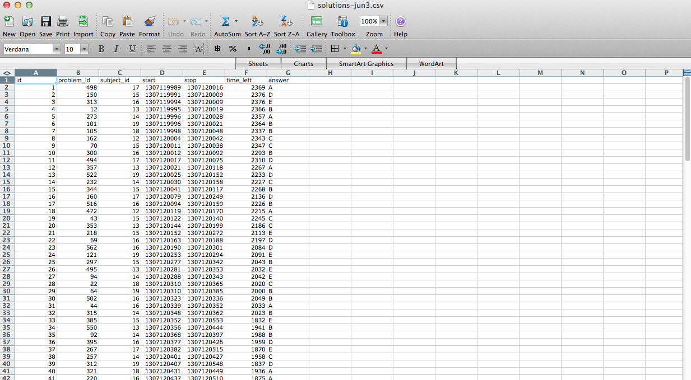

## The goal is tidy data



1. Each variable forms a column
2. Each observation forms a row
3. Each table/file stores data about one kind of observation (e.g. people/hospitals)

[http://vita.had.co.nz/papers/tidy-data.pdf](http://vita.had.co.nz/papers/tidy-data.pdf)

[Leek, Taub, and Pineda 2011 PLoS One](Leek, Taub, and Pineda 2011 PLoS One)

# Start with reshaping

``` r
library(reshape2)
head(mtcars)
```
``` r
                   mpg cyl disp  hp drat    wt  qsec vs am gear carb
Mazda RX4         21.0   6  160 110 3.90 2.620 16.46  0  1    4    4
Mazda RX4 Wag     21.0   6  160 110 3.90 2.875 17.02  0  1    4    4
Datsun 710        22.8   4  108  93 3.85 2.320 18.61  1  1    4    1
Hornet 4 Drive    21.4   6  258 110 3.08 3.215 19.44  1  0    3    1
Hornet Sportabout 18.7   8  360 175 3.15 3.440 17.02  0  0    3    2
Valiant           18.1   6  225 105 2.76 3.460 20.22  1  0    3    1 
```

## Melting data frames

``` r
mtcars$carname <- rownames(mtcars)
carMelt <- melt(mtcars, id=c("carname", "gear", "cyl"),
                measure.vars=c("mpg", "hp"))
head(carMelt, n=3)
```
``` r
        carname gear cyl variable value
1     Mazda RX4    4   6      mpg  21.0
2 Mazda RX4 Wag    4   6      mpg  21.0
3    Datsun 710    4   4      mpg  22.8
```
``` r
tail(carMelt, n=3)
```
``` r
         carname gear cyl variable value
62  Ferrari Dino    5   6       hp   175
63 Maserati Bora    5   8       hp   335
64    Volvo 142E    4   4       hp   109
```

## Casting data frames

``` r
cylData <- dcast(carMelt, cyl ~ variable) # Syntax: rows ~ cols
cylData
```
``` r
  cyl mpg hp
1   4  11 11
2   6   7  7
3   8  14 14
```
``` r
cylData <- dcast(carMelt, cyl ~ variable, mean) # Syntax: rows ~ cols, func
cylData
```
``` r
  cyl      mpg        hp
1   4 26.66364  82.63636
2   6 19.74286 122.28571
3   8 15.10000 209.21429
```

## Averaging values

``` r
head(InsectSprays)
```
``` r
  count spray
1    10     A
2     7     A
3    20     A
4    14     A
5    14     A
6    12     A
```
``` r
tapply(InsectSprays$count, InsectSprays$spray, sum) #Syntax: measure, dim, func
```
``` r
  A   B   C   D   E   F 
174 184  25  59  42 200
``` 

#### [http://www.r-bloggers.com/a-quick-primer-on-split-apply-combine-problems/](http://www.r-bloggers.com/a-quick-primer-on-split-apply-combine-problems/)

## Split-Apply-Combine

``` r
# Option 1
spIns <- split(InsectSprays$count, InsectSprays$spray)
sprCount <- lapply(spIns, sum)
unlist(sprCount)
```
``` r
  A   B   C   D   E   F 
174 184  25  59  42 200 
```

``` r
# Option 2
spIns <- split(InsectSprays$count, InsectSprays$spray)
sapply(spIns, sum)
```
``` r
  A   B   C   D   E   F 
174 184  25  59  42 200 
```

## Another way -- plyr package

``` r
library(plyr)
ddply(InsectSprays, .(spray), summarize, sum=sum(count))
```
``` r
  spray sum
1     A 174
2     B 184
3     C  25
4     D  59
5     E  42
6     F 200
```

## Creating a windowed sum

``` r
library(plyr)
spraySums <- ddply(InsectSprays, .(spray), summarize, sum=ave(count, FUN=sum))
dim(spraySums)
```
``` r
[1] 72  2
```
``` r
head(spraySums)
```
``` r
  spray sum
1     A 174
2     A 174
3     A 174
4     A 174
5     A 174
6     A 174
```

## More information
- A tutorial from the developer of _plyr_ - [http://plyr.had.co.nz/09-user/](http://plyr.had.co.nz/09-user/)
- A nice _reshape_ tutorial - [http://www.slideshare.net/jeffreybreen/reshaping-data-in-r](http://www.slideshare.net/jeffreybreen/reshaping-data-in-r)
- A good plyr primer - [http://www.r-bloggers.com/a-quick-primer-on-split-apply-combine-problems/](http://www.r-bloggers.com/a-quick-primer-on-split-apply-combine-problems/)
- See also the functions
	- `acast` - for casting as multi-dimensional arrays
	- `arrange` - for faster reordering without using `order()` commands
	- `mutate` - adding new variables 