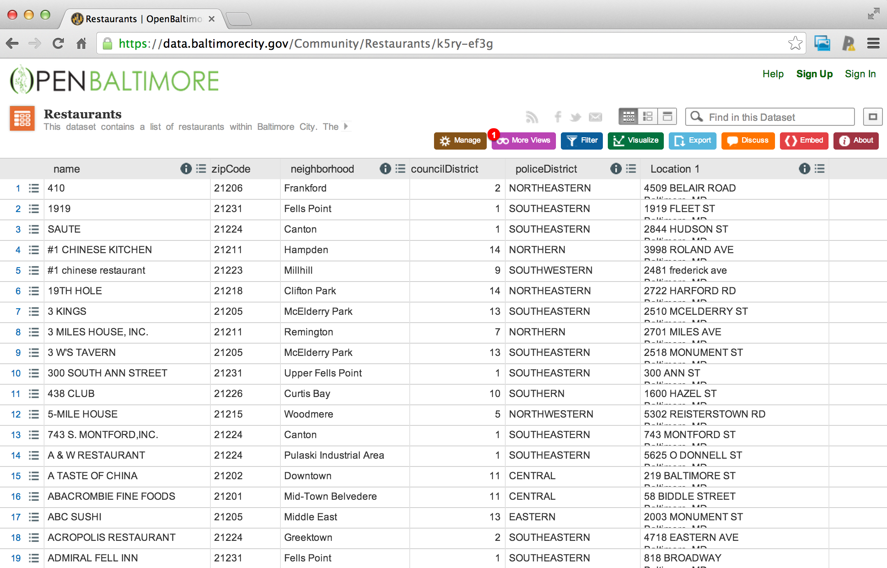

## Example data set



#### [https://data.baltimorecity.gov/Community/Restaurants/k5ry-ef3g](https://data.baltimorecity.gov/Community/Restaurants/k5ry-ef3g)

## Getting the data from the web

``` r
if(!file.exists("./data")) { dir.create("./data") }
fileUrl <- "https://data.baltimorecity.gov/api/views/k5ry-ef3g/rows.csv?accessType=DOWNLOAD"
download.file(fileUrl, destfile="./data/restaurants.csv")
```
``` r
trying URL 'https://data.baltimorecity.gov/api/views/k5ry-ef3g/rows.csv?accessType=DOWNLOAD'
Content type 'text/csv; charset=utf-8' length 112114 bytes (109 Kb)
opened URL
downloaded 109 Kb
```
``` r
restData <- read.csv("./data/restaurants.csv")
```

## Look at a bit off the data

``` r
head(restData, n=3)
```
``` r
   name zipCode neighborhood councilDistrict policeDistrict
1   410   21206    Frankford               2   NORTHEASTERN
2  1919   21231  Fells Point               1   SOUTHEASTERN
3 SAUTE   21224       Canton               1   SOUTHEASTERN
                         Location.1
1 4509 BELAIR ROAD\nBaltimore, MD\n
2    1919 FLEET ST\nBaltimore, MD\n
3   2844 HUDSON ST\nBaltimore, MD\n
```
``` r
tail(restData, n=3)
```
``` r
             name zipCode  neighborhood councilDistrict policeDistrict
1325 ZINK'S CAF   21213 Belair-Edison              13   NORTHEASTERN
1326 ZISSIMOS BAR   21211       Hampden               7       NORTHERN
1327       ZORBAS   21224     Greektown               2   SOUTHEASTERN
                             Location.1
1325 3300 LAWNVIEW AVE\nBaltimore, MD\n
1326      1023 36TH ST\nBaltimore, MD\n
1327  4710 EASTERN Ave\nBaltimore, MD\n
```

## Make summary

``` r
summary(restData)
```
``` r
                           name         zipCode             neighborhood
 MCDONALD'S                  :   8   Min.   :-21226   Downtown    :128  
 POPEYES FAMOUS FRIED CHICKEN:   7   1st Qu.: 21202   Fells Point : 91  
 SUBWAY                      :   6   Median : 21218   Inner Harbor: 89  
 KENTUCKY FRIED CHICKEN      :   5   Mean   : 21185   Canton      : 81  
 BURGER KING                 :   4   3rd Qu.: 21226   Federal Hill: 42  
 DUNKIN DONUTS               :   4   Max.   : 21287   Mount Vernon: 33  
 (Other)                     :1293                    (Other)     :863  
 councilDistrict       policeDistrict                          Location.1    
 Min.   : 1.000   SOUTHEASTERN:385    1101 RUSSELL ST\nBaltimore, MD\n:   9  
 1st Qu.: 2.000   CENTRAL     :288    201 PRATT ST\nBaltimore, MD\n   :   8  
 Median : 9.000   SOUTHERN    :213    2400 BOSTON ST\nBaltimore, MD\n :   8  
 Mean   : 7.191   NORTHERN    :157    300 LIGHT ST\nBaltimore, MD\n   :   5  
 3rd Qu.:11.000   NORTHEASTERN: 72    300 CHARLES ST\nBaltimore, MD\n :   4  
 Max.   :14.000   EASTERN     : 67    301 LIGHT ST\nBaltimore, MD\n   :   4  
                  (Other)     :145    (Other)                         :1289  
```

## More in depth information

``` r
str(restData)
```
``` r
'data.frame':	1327 obs. of  6 variables:
 $ name           : Factor w/ 1277 levels "#1 CHINESE KITCHEN",..: 9 3 992 1 2 4 5 6 7 8 ...
 $ zipCode        : int  21206 21231 21224 21211 21223 21218 21205 21211 21205 21231 ...
 $ neighborhood   : Factor w/ 173 levels "Abell","Arlington",..: 53 52 18 66 104 33 98 133 98 157 ...
 $ councilDistrict: int  2 1 1 14 9 14 13 7 13 1 ...
 $ policeDistrict : Factor w/ 9 levels "CENTRAL","EASTERN",..: 3 6 6 4 8 3 6 4 6 6 ...
 $ Location.1     : Factor w/ 1210 levels "1 BIDDLE ST\nBaltimore, MD\n",..: 835 334 554 755 492 537 505 530 507 569 ...
```

## Quantiles of quantitative variables

``` r
quantile(restData$councilDistrict, na.rm=T)
```
``` r
  0%  25%  50%  75% 100% 
   1    2    9   11   14
```
``` r
quantile(restData$councilDistrict, probs=c(0.5, 0.75, 0.9))
```
``` r
50% 75% 90% 
  9  11  12 
```

## Make table

``` r
table(restData$zipCode, useNA="ifany") # By default, does not show you missing vals
```
``` r
-21226  21201  21202  21205  21206  21207  21208  21209  21210  21211  21212 
     1    136    201     27     30      4      1      8     23     41     28 
 21213  21214  21215  21216  21217  21218  21220  21222  21223  21224  21225 
    31     17     54     10     32     69      1      7     56    199     19 
 21226  21227  21229  21230  21231  21234  21237  21239  21251  21287 
    18      4     13    156    127      7      1      3      2      1 
```

## Make 2 dimensional data

``` r
table(restData$councilDistrict, restData$zipCode)
```
``` r
     -21226 21201 21202 21205 21206 21207 21208 21209 21210 21211 21212 21213
  1       0     0    37     0     0     0     0     0     0     0     0     2
  2       0     0     0     3    27     0     0     0     0     0     0     0
  3       0     0     0     0     0     0     0     0     0     0     0     2
  4       0     0     0     0     0     0     0     0     0     0    27     0
  5       0     0     0     0     0     3     0     6     0     0     0     0
  6       0     0     0     0     0     0     0     1    19     0     0     0
  7       0     0     0     0     0     0     0     1     0    27     0     0
  8       0     0     0     0     0     1     0     0     0     0     0     0
  9       0     1     0     0     0     0     0     0     0     0     0     0
  10      1     0     1     0     0     0     0     0     0     0     0     0
  11      0   115   139     0     0     0     1     0     0     0     1     0
  12      0    20    24     4     0     0     0     0     0     0     0    13
  13      0     0     0    20     3     0     0     0     0     0     0    13
  14      0     0     0     0     0     0     0     0     4    14     0     1
    
     21214 21215 21216 21217 21218 21220 21222 21223 21224 21225 21226 21227 21229
  1      0     0     0     0     0     0     7     0   140     1     0     0     0
  2      0     0     0     0     0     0     0     0    54     0     0     0     0
  3     17     0     0     0     3     0     0     0     0     0     0     1     0
  4      0     0     0     0     0     0     0     0     0     0     0     0     0
  5      0    31     0     0     0     0     0     0     0     0     0     0     0
  6      0    15     1     0     0     0     0     0     0     0     0     0     0
  7      0     6     7    15     6     0     0     0     0     0     0     0     0
  8      0     0     0     0     0     0     0     2     0     0     0     2    13
  9      0     0     2     8     0     0     0    53     0     0     0     0     0
  10     0     0     0     0     0     1     0     0     0    18    18     0     0
  11     0     0     0     9     0     0     0     1     0     0     0     0     0
  12     0     0     0     0    26     0     0     0     0     0     0     0     0
  13     0     1     0     0     0     0     0     0     5     0     0     1     0
  14     0     1     0     0    34     0     0     0     0     0     0     0     0
    
     21230 21231 21234 21237 21239 21251 21287
  1      1   124     0     0     0     0     0
  2      0     0     0     1     0     0     0
  3      0     0     7     0     0     2     0
  4      0     0     0     0     3     0     0
  5      0     0     0     0     0     0     0
  6      0     0     0     0     0     0     0
  7      0     0     0     0     0     0     0
  8      0     0     0     0     0     0     0
  9     11     0     0     0     0     0     0
  10   133     0     0     0     0     0     0
  11    11     0     0     0     0     0     0
  12     0     2     0     0     0     0     0
  13     0     1     0     0     0     0     1
  14     0     0     0     0     0     0     0
```

## Check for missing values

``` r
sum(is.na(restData$councilDistrict)) # One option
```
``` r
[1] 0
```
``` r
any(is.na(restData$councilDistrict)) # Another
```
``` r
[1] FALSE
```
``` r
all(restData$zipCode > 0) # Tests basic assumptions, such as "are these all positive?"
```
``` r
[1] FALSE
```

## Row and column sums (to identify NAs for each col or row)

``` r
colSums(is.na(restData))
```
``` r
           name         zipCode    neighborhood councilDistrict  policeDistrict 
              0               0               0               0               0 
     Location.1 
              0
```
``` r
all(colSums(is.na(restData))==0)
```
``` r
[1] TRUE
```

## Values with specific characteristics

``` r
summary(restData$zipCode %in% c("21212")) # Makes a logical vector
```
``` r
   Mode   FALSE    TRUE    NA's 
logical    1299      28       0 
```
``` r
summary(restData$zipCode %in% c("21212", "21213")) # Likewise
```
``` r
   Mode   FALSE    TRUE    NA's 
logical    1268      59       0 
```
``` r
# Using that logical vector, you can subset rows
head(restData[restData$zipCode %in% c("212121", "21213"),])
```
``` r
                                  name zipCode                neighborhood
39                         BERMUDA BAR   21213               Broadway East
111         BALTIMORE ESTONIAN SOCIETY   21213          South Clifton Park
266 CLIFTON PARK GOLF COURSE SNACK BAR   21213                 Darley Park
276             CLUB HOUSE BAR & GRILL   21213 Orangeville Industrial Area
289              CLUBHOUSE BAR & GRILL   21213 Orangeville Industrial Area
291                        COCKY LOU'S   21213               Broadway East
    councilDistrict policeDistrict                       Location.1
39               12        EASTERN  1801 NORTH AVE\nBaltimore, MD\n
111              12        EASTERN  1932 BELAIR RD\nBaltimore, MD\n
266              14   NORTHEASTERN   2701 ST LO DR\nBaltimore, MD\n
276              13        EASTERN 4217 ERDMAN AVE\nBaltimore, MD\n
289              13        EASTERN 4217 ERDMAN AVE\nBaltimore, MD\n
291              12        EASTERN  2101 NORTH AVE\nBaltimore, MD\n
```

## Crosstabs

``` r
data(UCBAdmissions)
DF <- as.data.frame(UCBAdmissions)
summary(DF)
```
``` r
      Admit       Gender   Dept       Freq      
 Admitted:12   Male  :12   A:4   Min.   :  8.0  
 Rejected:12   Female:12   B:4   1st Qu.: 80.0  
                           C:4   Median :170.0  
                           D:4   Mean   :188.6  
                           E:4   3rd Qu.:302.5  
                           F:4   Max.   :512.0  
```
``` r
xt <- xtabs(Freq ~ Gender + Admit, data=DF) # Syntax is Value ~ Row + Col
xt
```
``` r
        Admit
Gender   Admitted Rejected
  Male       1198     1493
  Female      557     1278
```

## Flat tables

``` r
# Demonstrate pivoting on multiple fields (generates multiple tables as
# number of dimensions increase)
warpbreaks$replicate <- rep(1:9, len=54)
xt <- xtabs(breaks ~ ., data=warpbreaks) # '.' means use all fields for pivot
xt
```
``` r
, , replicate = 1

    tension
wool  L  M  H
   A 26 18 36
   B 27 42 20

, , replicate = 2

    tension
wool  L  M  H
   A 30 21 21
   B 14 26 21

, , replicate = 3

    tension
wool  L  M  H
   A 54 29 24
   B 29 19 24

, , replicate = 4

    tension
wool  L  M  H
   A 25 17 18
   B 19 16 17

, , replicate = 5

    tension
wool  L  M  H
   A 70 12 10
   B 29 39 13

, , replicate = 6

    tension
wool  L  M  H
   A 52 18 43
   B 31 28 15

, , replicate = 7

    tension
wool  L  M  H
   A 51 35 28
   B 41 21 15

, , replicate = 8

    tension
wool  L  M  H
   A 26 30 15
   B 20 39 16

, , replicate = 9

    tension
wool  L  M  H
   A 67 36 26
   B 44 29 28

```
``` r
# Condens back into a single flat table
ftable(xt)
```
``` r
             replicate  1  2  3  4  5  6  7  8  9
wool tension                                     
A    L                 26 30 54 25 70 52 51 26 67
     M                 18 21 29 17 12 18 35 30 36
     H                 36 21 24 18 10 43 28 15 26
B    L                 27 14 29 19 29 31 41 20 44
     M                 42 26 19 16 39 28 21 39 29
     H                 20 21 24 17 13 15 15 16 28
```

## Size of the object in memory

``` r
fakeData <- rnorm(1e5)
object.size(fakeData)
```
``` r
800040 bytes
```
``` r
print(object.size(fakeData), units="Mb")
```
``` r
0.8 Mb
```